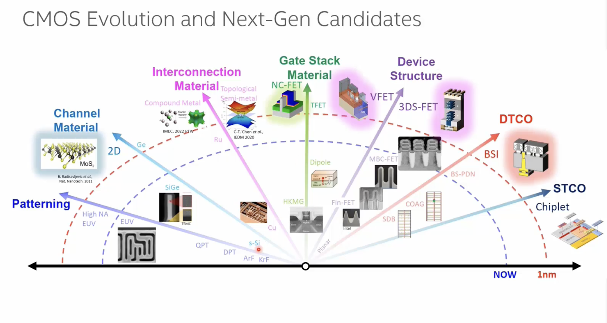

# L2 — CMOS Evolution and Next-Gen Candidates

**Course:** FinFET Circuit Design and Characterization
**Module:** 1 — Scaling Beyond CMOS: FinFET Devices and Innovations
**Lecture:** 2 of 9

---

## Overview

This lecture maps how semiconductor technology has evolved across **six key dimensions** — and where each is headed. Modern chip scaling is no longer just about shrinking transistor geometry. It is a coordinated push across lithography, materials science, device physics, process engineering, and system architecture — all advancing simultaneously.

> **Key insight:** The industry has shifted from purely geometric scaling (Moore's Law) to a multi-axis optimisation where progress in one dimension often enables — or demands — changes in others.



*Source: Daewon Ha, Energy-efficient CMOS scaling for 1nm and beyond, IEDM 2022*

---

## 1. Patterning
*Printing circuit features onto silicon using light*

Patterning is the process of transferring a circuit design onto a silicon wafer using light. A shorter wavelength of light means finer, more precise features — like using a sharper pencil tip.

| Era | Technology | What it means |
|-----|-----------|---------------|
| Past | **KrF — 248 nm** | First widely-used deep UV light source |
| Past | **ArF — 193 nm** | Shorter wavelength; enabled smaller features |
| Past | **Double Patterning (DPT) / Quad Patterning (QPT)** | When light couldn't shrink further, the same pattern was printed in 2 or 4 passes to halve/quarter the effective pitch |
| **Now** | **EUV — 13.5 nm** | Fundamentally shorter wavelength; one EUV exposure replaces multiple older passes |
| **Next** | **High-NA EUV** | Larger numerical aperture optics — like a higher-magnification lens — for even finer resolution |

> **Why it matters:** Every generation of patterning directly determines the minimum size of transistors and wires that can be printed on a chip.

---

## 2. Channel Material
*The material through which current flows inside a transistor*

The channel is the region of a transistor that switches on and off. The key property is **carrier mobility** — how fast electrons (NMOS) or holes (PMOS) move through it. Faster carriers = more drive current = faster, more efficient circuits.

| Era | Material | What it means |
|-----|---------|---------------|
| Past | **Bulk Silicon** | Reliable and well-understood; foundational for decades |
| Past | **Strained Silicon / Strained SiGe** | Physically stretching the crystal lattice makes carriers move faster — more current for the same voltage |
| **Now** | **SiGe PFETs (TSMC 5 nm)** | Silicon-germanium alloy gives the p-type transistor a significant speed and efficiency boost |
| **Next** | **2D Materials (e.g. MoS₂)** | Atomically thin sheets; silicon breaks down electrically below ~7 nm gate length — 2D materials keep working, demonstrated down to 1 nm gate length |

---

## 3. Interconnection Material
*The metal wires that link transistors together on a chip*

After transistors are built, they must be connected by metal wires running through multiple layers above the silicon. The key property is **resistivity** — lower resistance means less power wasted and faster signal travel.

| Era | Material | Process | What it means |
|-----|---------|---------|---------------|
| Past | **Aluminium (Al)** | Subtractive etch — pattern then remove | Simple but resistance climbs steeply as wire width shrinks |
| Past | **Copper (Cu)** introduced at 180 nm | Dual damascene — dig trenches, fill with Cu, polish flat (CMP) | Lower resistivity than Al; Cu can't be etched so the process is inverted |
| **Next** | **Ruthenium (Ru)** | Subtractive etch (like Al — simpler) | At very narrow line widths, Ru has lower resistance than Cu and avoids the complex damascene flow |
| **R&D** | **Compound metals / Topological semi-metals** | — | Exotic conductors that may carry current with near-zero scattering at atomic scales |

> **What is CMP?** Chemical Mechanical Planarisation — a polishing step that grinds the wafer surface flat after filling metal into trenches.

---

## 4. Gate Stack
*The insulating layer + electrode that controls the transistor switch*

The gate stack sits directly above the channel. The **gate oxide** insulates the gate from the channel; the **gate electrode** applies the voltage that switches the transistor on or off. Thinner oxide = stronger gate control, but too thin causes leakage current.

| Era | Gate Oxide | Gate Electrode | What changed |
|-----|-----------|---------------|-------------|
| Past | **SiO₂** (silicon dioxide) | **Polysilicon** | Classical combination; thermally grown SiO₂ |
| Past | **Nitrided SiO₂ (SiON)** | Polysilicon | Adding nitrogen plugs defects and reduces leakage, extending the SiO₂ era |
| **Now** | **High-k dielectric (e.g. HfO₂)** | **Metal gate** | High-k is physically thicker but electrically equivalent to ultra-thin SiO₂ — stops leakage. Metal gate replaces polysilicon for better conductivity. Introduced at 45 nm. |
| **Now** | HKMG + **Dipole engineering** | Metal gate | Inserting thin interlayers at the oxide interface shifts the threshold voltage (Vt) without changing the oxide itself — allows multiple Vt flavours on one chip |
| **Next** | **Ferroelectric oxides (NC-FET)** | Metal gate | Ferroelectrics have a negative capacitance effect that amplifies gate control — steeper switching with less voltage |

> **What is Vt (threshold voltage)?** The minimum gate voltage needed to turn a transistor on. Different circuit blocks need different Vt values to balance speed and leakage.

---

## 5. Device Architecture
*The 3D shape of the transistor itself*

As gate lengths shrink, the drain terminal starts influencing the channel even when the gate says "off" — called **short-channel effects**. Each architecture generation improves electrostatic control to suppress this.

| Era | Architecture | Gate control | Key benefit |
|-----|-------------|-------------|-------------|
| Past | **Planar FET** | Gate on top only (1 side) | Simple; works at large sizes |
| Past | **FinFET** | Gate wraps 3 sides of a vertical fin | Dramatically reduces short-channel effects; better on/off switching |
| **Now** | **Gate-All-Around (GAA) / Nanosheet FET** | Gate wraps all 4 sides of stacked nano-ribbons | Maximum electrostatic control; nanosheet width tunable for drive current |
| **Next** | **CFET (Complementary FET)** | N and P transistors stacked vertically | Halves the standard-cell footprint — more logic per mm² without shrinking the transistor itself |

> **What is a standard cell?** A pre-designed logic building block (AND gate, flip-flop, etc.) laid out to a fixed height. Reducing standard-cell area directly reduces chip area and cost.

---

## 6. DTCO — Design-Technology Co-Optimisation
*Process innovations that directly shrink circuit layout area*

DTCO refers to changes in the fabrication process that are co-developed with circuit designers to reduce the area occupied by standard cells — without necessarily shrinking the transistor itself.

| Era | Innovation | What it means |
|-----|-----------|---------------|
| Past | **Double Diffusion Break (DDB) → Single Diffusion Break (SDB)** | The isolation cut between adjacent transistors shrinks from double to single — recovering area without hurting isolation |
| Past | **COAG** (Contact-Over-Active-Gate) | Gate contacts can now land directly over the active transistor area instead of outside it — frees routing space inside the cell |
| **Now** | **Backside Power Delivery Network (BS-PDN)** | Power rails moved from the front (signal) side to the back of the wafer — front-side metal layers freed entirely for signals, reducing congestion and IR drop |
| **Next** | **Backside Signalling** | Extends backside routing to signal nets alongside power — gives the chip a second wiring plane, dramatically improving routability |

---

## 7. STCO — System-Technology Co-Optimisation & Chiplets
*Splitting a chip into smaller dies, each manufactured on its best-fit process*

Not every function on a chip benefits from the most advanced (and most expensive) process node. The **chiplet** approach partitions a system into separate dies that are then co-packaged.

| Integration | Description | What it means |
|------------|-------------|---------------|
| **Chiplets** | Separate dies for different functions (CPU, analog, I/O, memory) | Analogue circuits often work better on mature nodes; digital logic benefits from leading-edge. Each chiplet uses its optimal process. |
| **2.5D Integration** | Dies placed side-by-side on a silicon or organic interposer | The interposer is a passive routing layer connecting chiplets with dense, short wires — much higher bandwidth than PCB traces |
| **3D Integration** | Dies stacked vertically with Through-Silicon Vias (TSVs) | Shortens the path between compute and memory from millimetres to micrometres — large bandwidth and latency gains |

> **Analogy:** Think of chiplets like building a PC — CPU, GPU, and RAM are separate components. Chiplets do the same, but all in a single package with much shorter, faster connections between them.

---

## Summary Diagram Reference

The diagram from this lecture (*CMOS Evolution and Next-Gen Candidates*, Daewon Ha, IEDM 2022) maps all six dimensions on a single timeline from established technology on the left to future candidates on the right. "NOW" marks the current state-of-the-art; the rightmost arrow points toward the 1 nm era.

```
←————————————————————————————————————————————————→
Past          NOW                              1nm
KrF/ArF  →  EUV  →  High-NA EUV            [Patterning]
Si       →  SiGe →  2D Materials            [Channel]
Al → Cu  →  Cu   →  Ru / Compound Metals    [Interconnect]
SiO₂     →  HKMG →  Ferroelectric           [Gate Stack]
Planar   →  GAA  →  CFET                    [Device]
DDB/SDB  →  BS-PDN→  BS Signalling          [DTCO]
```

---

## Key Terminology

| Term | Meaning |
|------|---------|
| **EUV** | Extreme Ultraviolet — 13.5 nm wavelength lithography |
| **High-NA** | High Numerical Aperture — improved lens system for EUV |
| **SiGe** | Silicon-Germanium alloy |
| **HKMG** | High-k Metal Gate |
| **HfO₂** | Hafnium dioxide — the standard high-k dielectric |
| **NC-FET** | Negative Capacitance FET — uses ferroelectric gate oxide |
| **GAA** | Gate-All-Around transistor |
| **CFET** | Complementary FET — stacked N+P |
| **CMP** | Chemical Mechanical Planarisation — polishing step |
| **DTCO** | Design-Technology Co-Optimisation |
| **STCO** | System-Technology Co-Optimisation |
| **BS-PDN** | Backside Power Delivery Network |
| **TSV** | Through-Silicon Via — vertical electrical connection through a die |
| **Vt** | Threshold voltage |

---

## Navigation

| | Lecture |
|---|---------|
| ← Previous | [L1 — Path To Zetta Scale Computing](../L1_Path_To_Zetta_Scale/README.md) |
| → Next | [L3 — Introduction To FinFETs](../L3_Introduction_To_FinFETs/README.md) |
| ↑ Module | [Module 1 Overview](../../README.md#module-1) |
