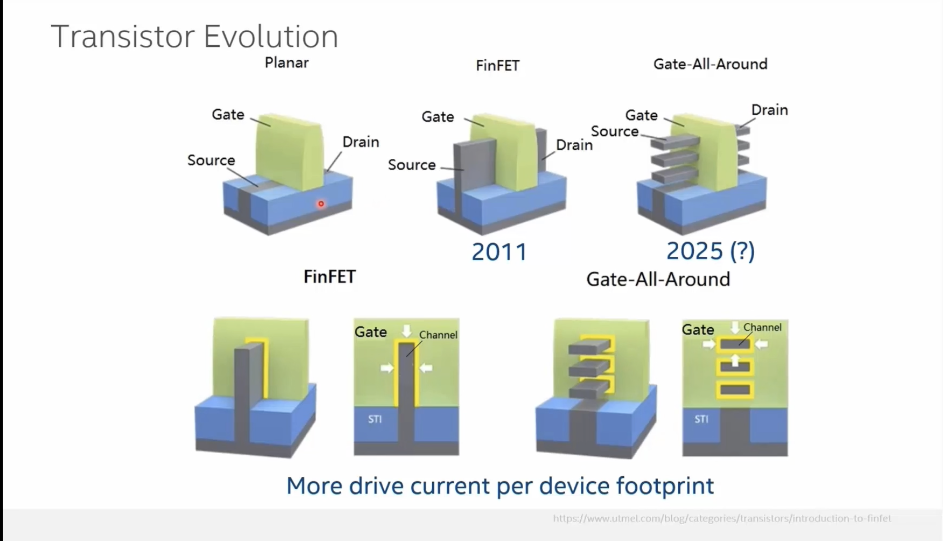
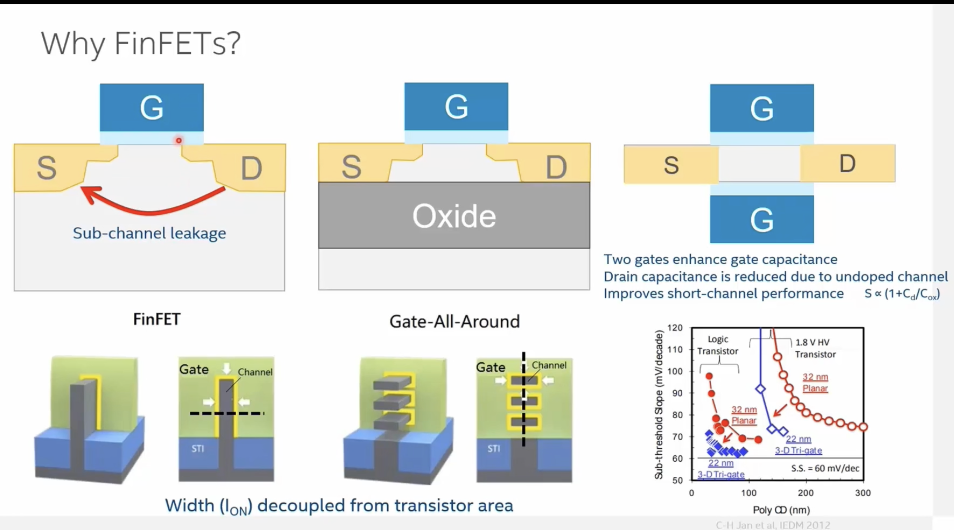
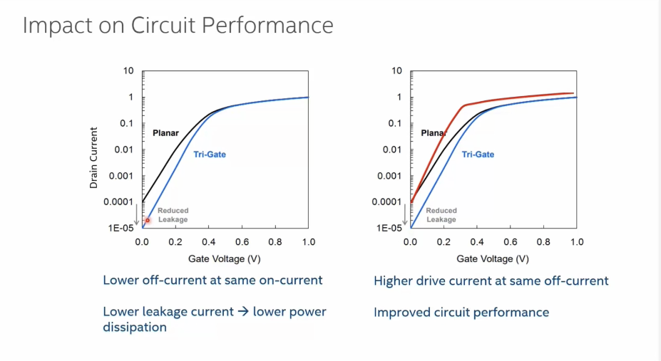

  

# L3 — Introduction to FinFETs
*How a vertical fin restored electrostatic control and enabled CMOS scaling beyond planar limits.*

---

## At a Glance

| | |
|---|---|
| **Core problem** | Planar transistors leak current through a sub-channel region the gate cannot control |
| **Key innovation** | Raising the silicon into a vertical fin so the gate wraps three sides (tri-gate) |
| **Introduced** | 2011 — Intel 22 nm node |
| **What comes next** | Gate-All-Around (GAA / nanosheet), gate surrounds channel on all four sides |
| **Key metric** | Subthreshold swing → ideal limit 60 mV/decade; FinFET gets much closer than planar |

---

## Summary

Planar MOSFETs dominated from the micron era down to ~28–32 nm, but shrinking them further caused uncontrollable sub-channel leakage and worsening subthreshold swing. FinFETs solved this by extruding the silicon channel into a thin vertical fin and wrapping the gate around three sides, giving far stronger electrostatic control and enabling an undoped channel that cuts parasitic capacitance. The same principle, taken to its logical conclusion, produces Gate-All-Around transistors where stacked nanosheets are fully enclosed by the gate.

---

## Sections

<details>
<summary><strong>1 — Transistor evolution: planar → FinFET → GAA</strong></summary>



| Architecture | Era | Gate geometry | Key property |
|---|---|---|---|
| Planar | ~2000 → 2011 | Top only | Simple, but poor short-channel control at small nodes |
| FinFET (tri-gate) | 2011 → ~2022 | Wraps 3 sides of vertical fin | Strong gate control; undoped channel possible |
| Gate-All-Around (GAA) | Modern advanced nodes | Surrounds stacked nanosheets | Successor to FinFET |

In both FinFET and GAA architectures the electrical width — set by the fin perimeter or nanosheet stack — is **decoupled from the device footprint**. This means more drive current per unit of silicon area compared to a planar device at the same node, a critical advantage as interconnect RC delay becomes the dominant performance bottleneck.

> 💡 **Why FinFETs deliver more current per area**
>
> In planar devices, increasing channel width increases footprint.
> In FinFETs, current scales with the fin perimeter while footprint grows much more slowly.
> This decoupling allows higher drive current density and becomes increasingly valuable as interconnect delays dominate modern chips.

</details>

<details>
<summary><strong>2 — Why FinFETs? The planar leakage problem</strong></summary>



| Planar failure mode | Root cause | FinFET fix |
|---|---|---|
| Sub-channel leakage | Gate only controls top surface; deep silicon is uncontrolled | Thin fin is fully depleted — no deep uncontrolled region |
| Heavy counter-doping required | Needed to suppress sub-channel current as channel shortens | Undoped (or lightly doped) channel enabled by strong gate wrap |
| Band-to-band tunnelling | High doping in both substrate and drain creates a steep junction | Eliminated with undoped channel and reduced drain capacitance |
| Poor subthreshold swing | High C_D relative to C_ox slows turn-on/off | ↑ C_ox (multi-gate) + ↓ C_D (undoped) pushes S toward 60 mV/dec |

**Fully-depleted channel concept.** Replacing the deep silicon beneath the channel with oxide (as in FD-SOI) or thinning it into a fin means the gate field depletes the *entire* channel body. With double-gate or tri-gate geometries this effect is further strengthened, and the channel can be left undoped — removing the random dopant fluctuation that degrades matching at advanced nodes.

**Subthreshold swing formula:**

$$S = \frac{kT}{q}\ln(10)\left(1 + \frac{C_D}{C_{ox}}\right)$$

Multi-gate transistors raise C_ox and lower C_D simultaneously, so S approaches the room-temperature ideal of **60 mV/decade**.

</details>

<details>
<summary><strong>3 — Performance impact on circuits</strong></summary>



| Scenario | Planar | Tri-Gate FinFET | Benefit |
|---|---|---|---|
| Same on-current | Higher I_off | **Much lower I_off** | Lower static (leakage) power |
| Same off-current | Lower I_on | **Higher I_on** | Better switching speed |
| Same supply voltage | Baseline | Higher drive current | Performance improvement |
| Lower VDD possible | — | Equal drive current at reduced V_DD | Lower dynamic power (P ∝ CV<sup>2</sup>f) |

Real data from Intel's 22 nm tri-gate (vs 32 nm planar) showed subthreshold swing for logic transistors approaching the 60 mV/decade ideal, with significant improvement for high-voltage transistors as well. Tuning V_T allows a designer to choose between leakage reduction *or* performance uplift — a flexibility planar devices did not offer at equivalent nodes.

</details>

---

## Key terminology

| Term | Definition |
|---|---|
| **FinFET** | Field-effect transistor with a vertical silicon fin; gate wraps three sides (tri-gate) |
| **GAA / Nanosheet** | Gate-All-Around: gate fully surrounds stacked horizontal sheets of silicon |
| **STI** | Shallow Trench Isolation — oxide-filled trenches separating adjacent devices |
| **Subthreshold swing (S)** | Gate voltage needed (mV) to change drain current by one decade; ideal = 60 mV/dec at room temp |
| **C_D / C_ox** | Depletion capacitance / oxide capacitance — ratio controls subthreshold swing |
| **Band-to-band tunnelling** | Quantum leakage between heavily doped drain and substrate; worsens with aggressive doping |
| **Fully depleted** | Channel body is entirely free of mobile carriers when the device is off; gate has complete control |
| **Electrical width** | Effective channel width = fin perimeter (FinFET) or nanosheet perimeter × stack count (GAA) |
| Electrostatic Control | Ability of the gate to control channel charge and suppress leakage |

---

## Lecture Insights

- FinFET is fundamentally an electrostatic solution, not just a geometry change.
- Better gate control enables lower leakage and improved switching behavior.
- Multi-gate architectures move subthreshold swing closer to the 60 mV/dec ideal.
- GAA extends the same principle further by surrounding the channel on all sides.
- As transistor performance improves, interconnect RC delay increasingly dominates system performance.

## Key takeaway

> **FinFETs replaced planar transistors because wrapping the gate around a vertical fin gave sufficient electrostatic control to suppress leakage, enable undoped channels, and keep subthreshold swing close to the physical 60 mV/decade limit — without which scaling beyond 28 nm would have been thermally and electrically impractical.**

---

## Files

```
L3_Introduction_To_FinFETs/
├── README.md               ← this file
└── Images/
    ├── why-finfets.png
    ├── transistor-evolution.png
    └── performance-impact.png
```

---

| | Lecture |
|---|---|
| ← Previous | [L2 — CMOS Evolution and Next-Gen Candidates](../L2_CMOS_Evolution_And_Next_Gen_Candidates/README.md) |
| ↑ Course | [Course Overview](../../README.md) |
| Next → | [L4 — FinFET Circuit Design Basics](../L4/README.md) |
