# nfin Analysis — VTC and Id Characteristics

> Investigating how PMOS/NMOS fin count ratio affects inverter switching threshold, drain current, and performance.
> Channel length **L = 7nm is fixed** throughout. Width is controlled via `nfin`.

---

## Contents

| # | Topic |
|---|-------|
| 1 | [Experiment 1 — PMOS fixed, NMOS varied](#1-experiment-1--pmos-fixed-nfin14-nmos-varied) |
| 2 | [Experiment 2 — NMOS fixed, PMOS varied](#2-experiment-2--nmos-fixed-nfin14-pmos-varied) |
| 3 | [Summary](#3-summary) |
| 4 | [Other Plots](#4-other-simulation-plots) |

---

## 1. Experiment 1 — PMOS fixed (nfin=14), NMOS varied

> **Goal:** Keep PMOS constant, increase NMOS strength progressively.
> **Expected:** VTC shifts left, Vth decreases as NMOS dominates.

```spice
.param pfin=14       ← fixed
.param nfin_val=6    ← change this: 6 → 14 → 19
```

### VTC Curves

| PMOS=14, NMOS=6 | PMOS=14, NMOS=14 | PMOS=14, NMOS=19 |
|:---------------:|:----------------:|:----------------:|
| PMOS dominates | Balanced | NMOS dominates |
|  | 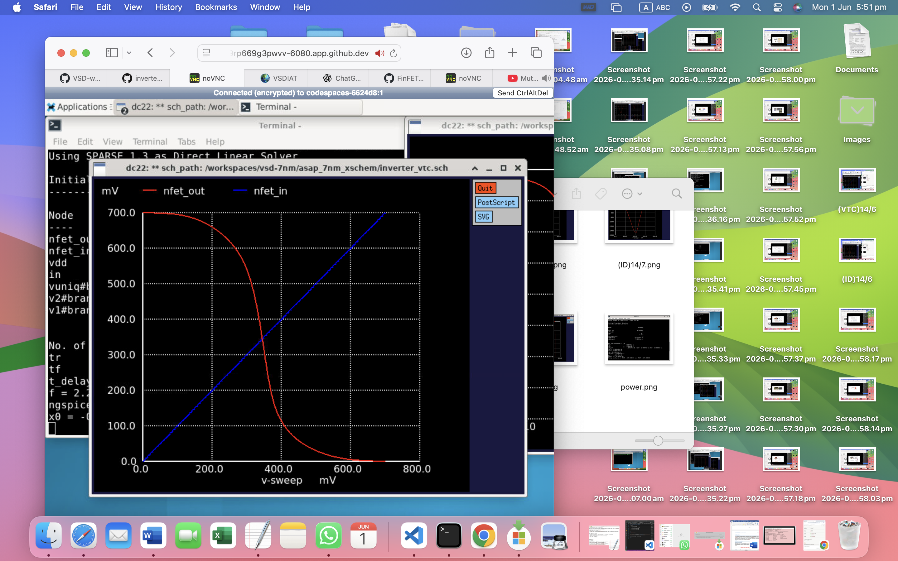 | 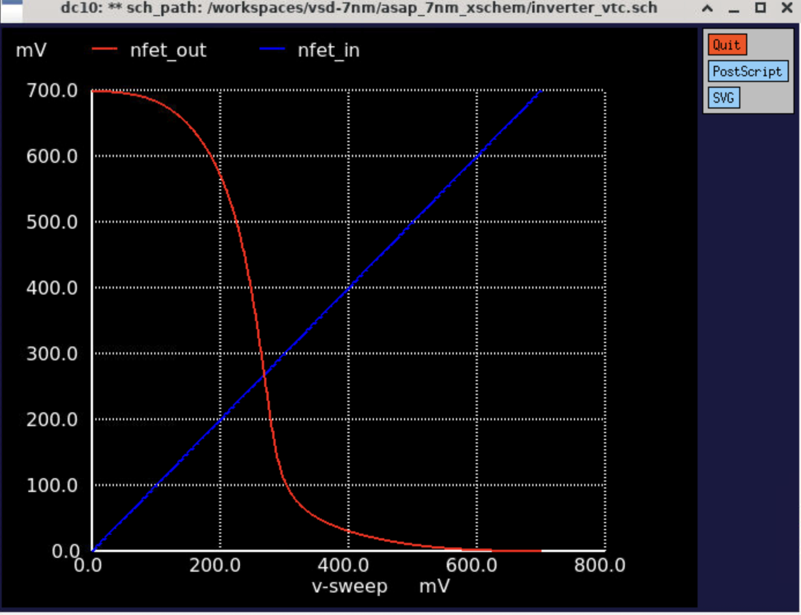 |
| Vth = 0.4209 V ↑ | Vth = 0.3448 V | Vth = 0.2682 V ↓ |

### Drain Current (Id)

| PMOS=14, NMOS=6 | PMOS=14, NMOS=14 | PMOS=14, NMOS=19 |
|:---------------:|:----------------:|:----------------:|
| 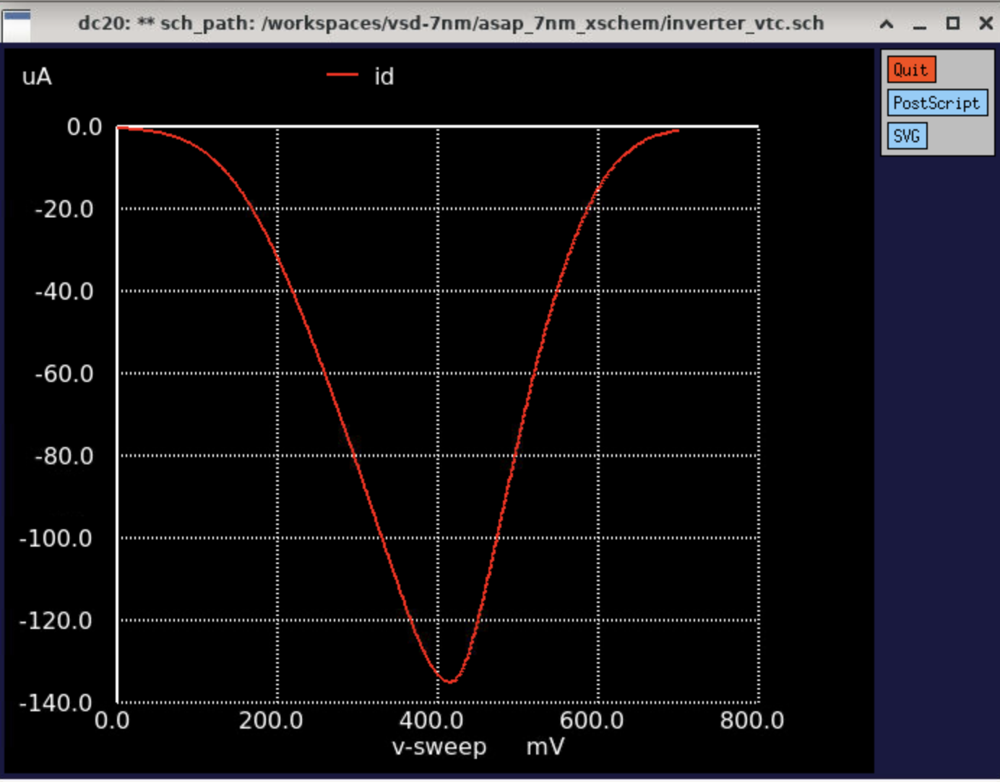 |  | 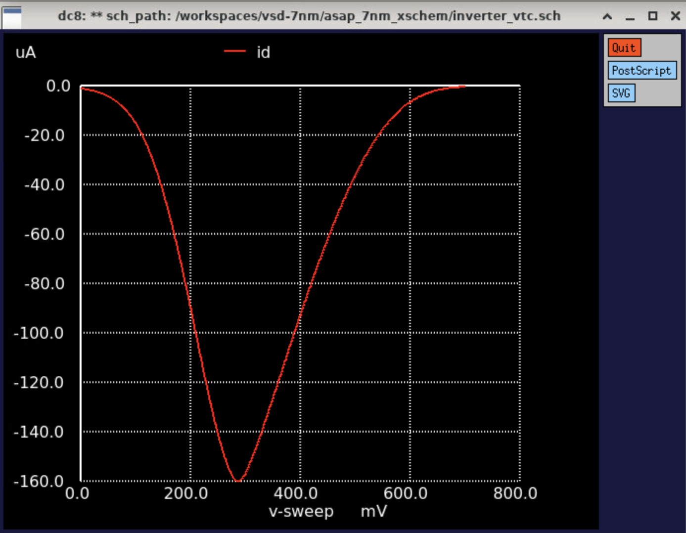 |

### Observations

- Vth shifts **left** (decreases) as NMOS nfin increases — stronger NMOS pulls output LOW faster
- Id peak shifts toward lower Vin as NMOS becomes dominant
- At NMOS=19, NMOS is ~3× stronger than PMOS — inverter heavily skewed toward LOW output

---

## 2. Experiment 2 — NMOS fixed (nfin=14), PMOS varied

> **Goal:** Keep NMOS constant, increase PMOS strength progressively.
> **Expected:** VTC shifts right, Vth increases as PMOS dominates.

```spice
.param pfin=6        ← change this: 6 → 14 → 19
.param nfin_val=14   ← fixed
```

### VTC Curves

| PMOS=6, NMOS=14 | PMOS=14, NMOS=14 | PMOS=19, NMOS=14 |
|:---------------:|:----------------:|:----------------:|
| NMOS dominates | Balanced | PMOS dominates |
| 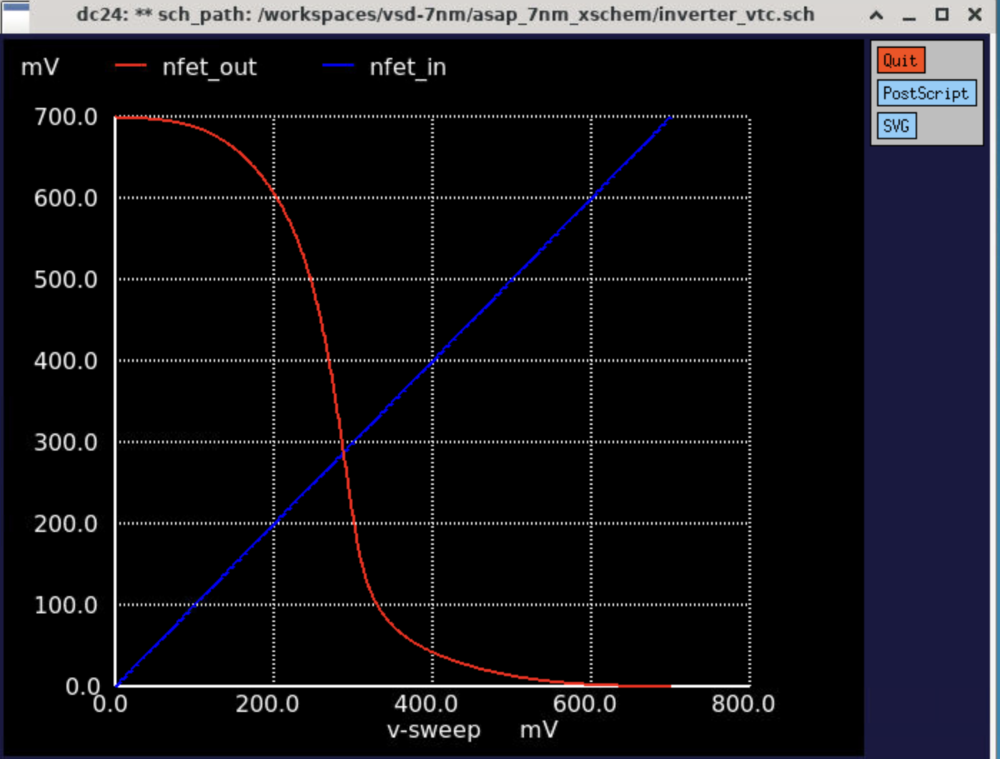 |  | 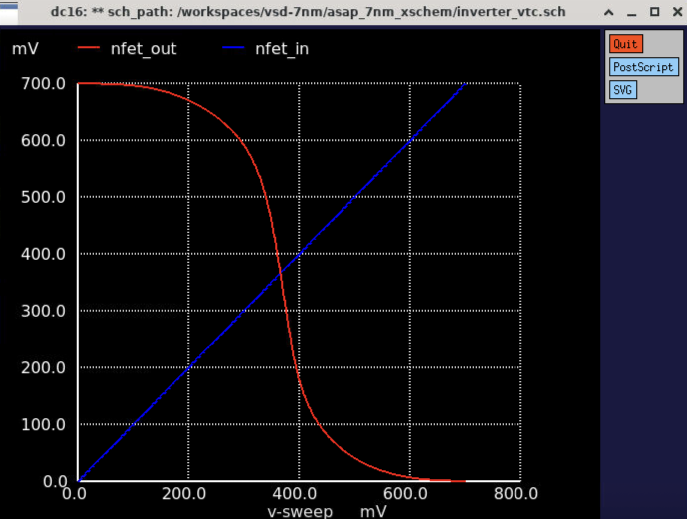 |
| Vth = 0.2682 V ↓ | Vth = 0.3448 V | Vth = 0.3658 V ↑ |

### Drain Current (Id)

| PMOS=6, NMOS=14 | PMOS=14, NMOS=14 | PMOS=19, NMOS=14 |
|:---------------:|:----------------:|:----------------:|
| 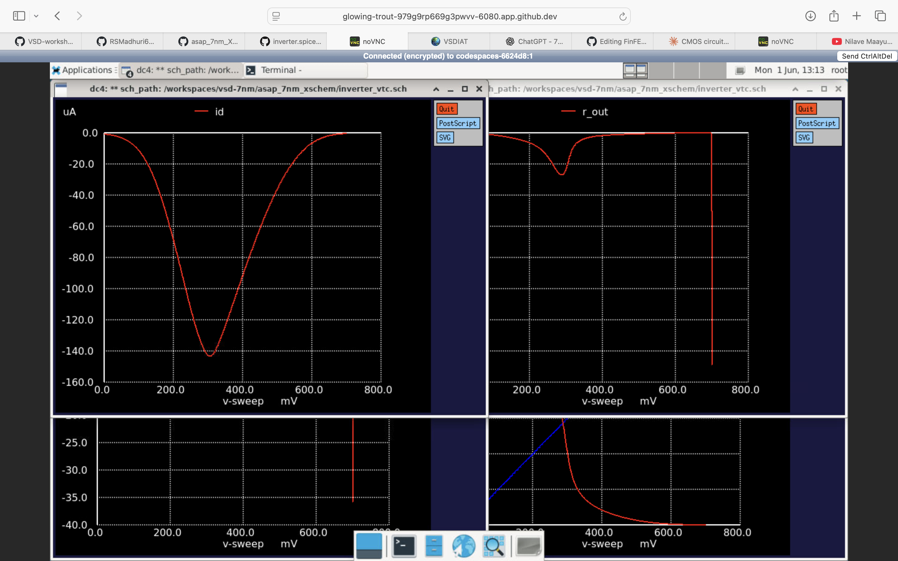 |  |  |

### Observations

- Vth shifts **right** (increases) as PMOS nfin increases — stronger PMOS holds output HIGH longer
- Id peak shifts toward higher Vin as PMOS becomes dominant
- 14/14 acts as the shared balanced baseline between both experiments

---

## 3. Summary

### Vth vs nfin Ratio

| Experiment | PMOS nfin | NMOS nfin | Ratio | Vth (V) | Dominant |
|:----------:|:---------:|:---------:|:-----:|:-------:|:--------:|
| 1 | 14 | 6 | 2.3:1 | 0.4209 | PMOS ↑ |
| 1 | 14 | 14 | 1:1 | 0.3448 | Balanced |
| 1 | 14 | 19 | 1:1.4 | 0.2682 | NMOS ↓ |
| 2 | 6 | 14 | 1:2.3 | 0.2682 | NMOS ↓ |
| 2 | 14 | 14 | 1:1 | 0.3448 | Balanced |
| 2 | 19 | 14 | 1.4:1 | 0.3658 | PMOS ↑ |

### Key Takeaways

- **Vth is controlled by the PMOS/NMOS strength ratio**, not absolute fin count
- **Equal ratio → Vth ≈ VDD/2** regardless of how many fins are used
- **Stronger NMOS → Vth shifts toward GND** (lower)
- **Stronger PMOS → Vth shifts toward VDD** (higher)
- Both experiments share **14/14 as a common balanced reference point**

---

## 4. Other Simulation Plots

<details>
<summary><b>Gain — with and without abs()</b></summary>

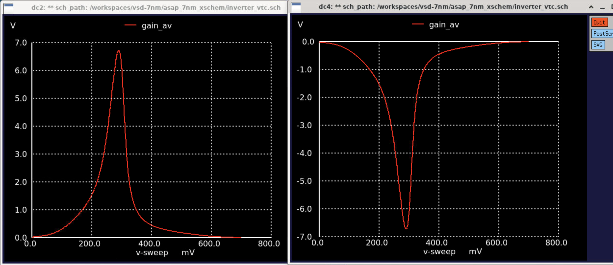

> Raw gain dVout/dVin and its absolute value. Peak of |gain| marks the maximum gain point used to extract VIL, VIH, VOL, VOH.

</details>

<details>
<summary><b>Transconductance (gm)</b></summary>

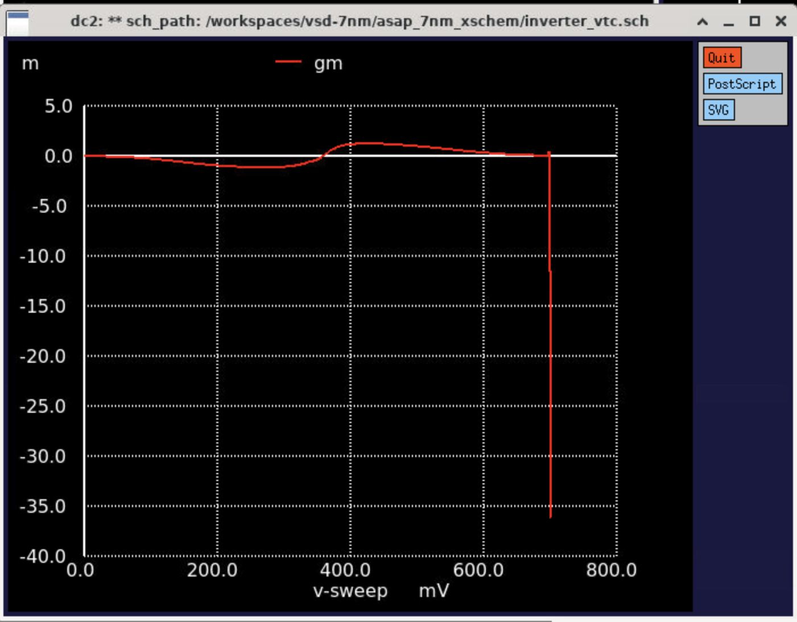

> gm = dId/dVin — peaks near the switching threshold. Higher nfin → higher peak gm proportionally.

</details>

<details>
<summary><b>Output Resistance (rout)</b></summary>

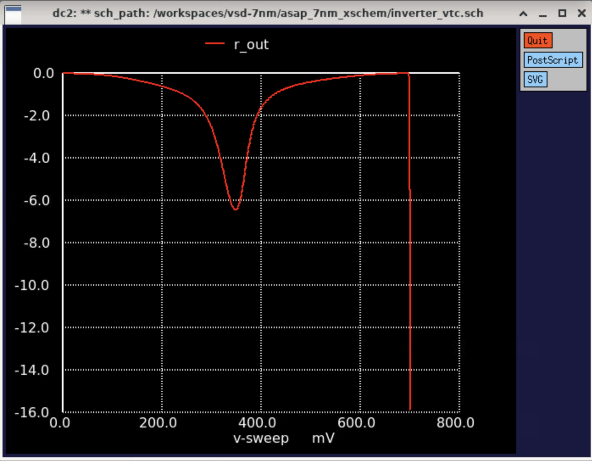

> rout = dVout/dId — high in saturation regions, drops sharply near the switching point.

</details>

<details>
<summary><b>Propagation Delay</b></summary>

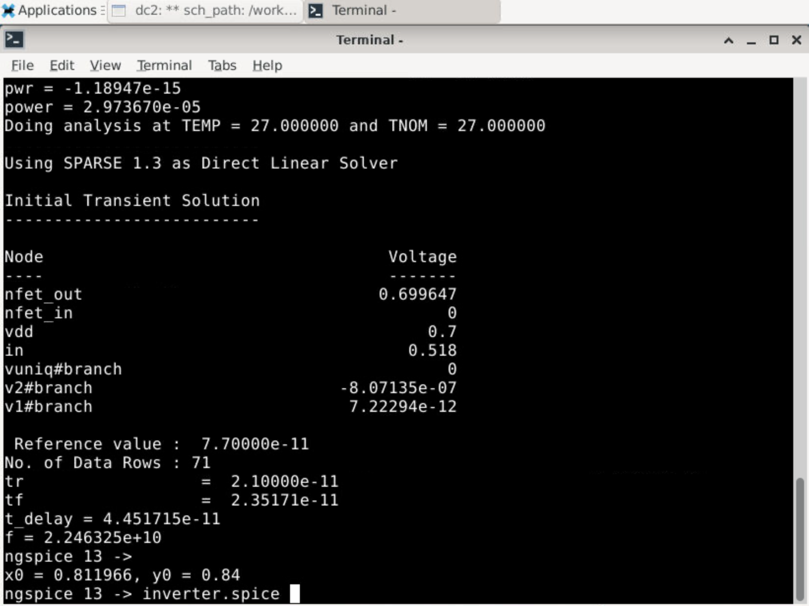

> Transient waveform showing tprise and tpfall. tpd = (tpr + tpf) / 2.

</details>

<details>
<summary><b>Power Consumption</b></summary>

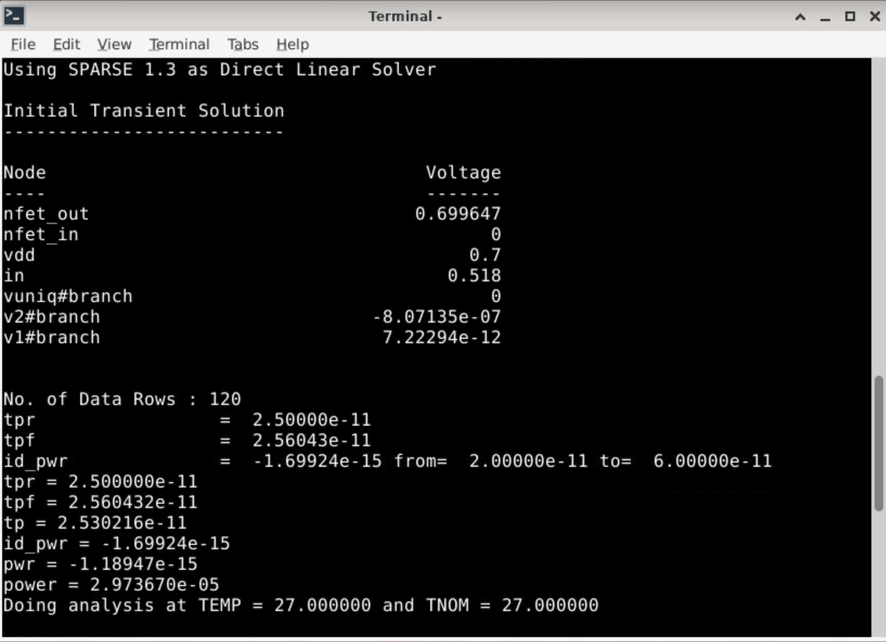

> Average power extracted by integrating Id over one switching cycle × VDD.

</details>

<details>
<summary><b>Id vs Vd</b></summary>


> Drain current vs drain voltage — shows linear and saturation regions of the FinFET device.

</details>

<details>
<summary><b>Simulation Terminal Output</b></summary>

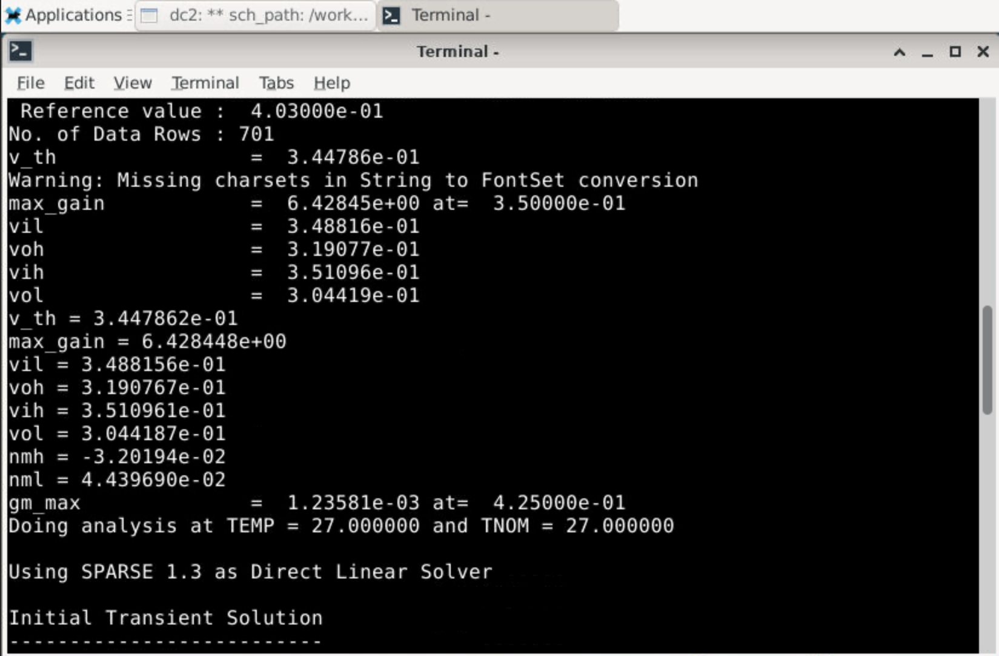

> ngspice terminal output showing all extracted values: Vth, max_gain, VIL, VIH, VOH, VOL, NMH, NML, gm_max, tpr, tpf, tp, power, f.

</details>

---

| | |
|---|---|
| ← Back | [README — Assignment](README.md) |
| ↑ Module | [Module 2 Overview](../README.md) |
| ↑ Course | [Course Overview](../../README.md) |
