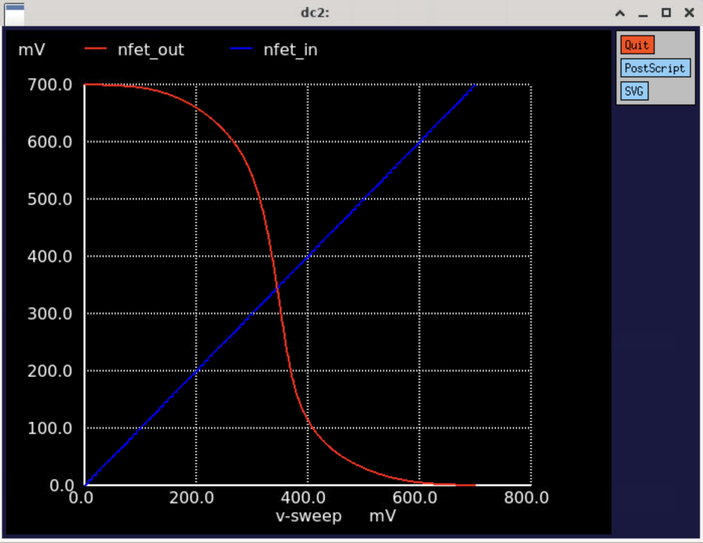
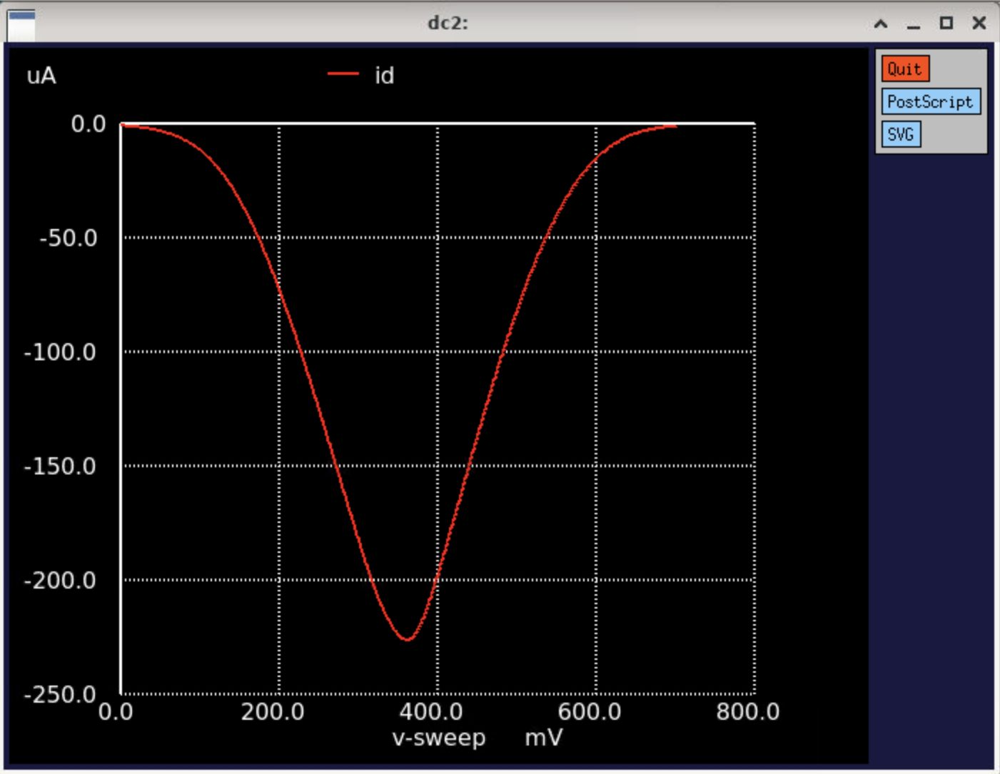

# Assignment — 7nm FinFET Inverter Characterization


> Characterisation of a 7nm FinFET CMOS inverter across 7 W/L configurations — extracting switching threshold, drain current, power, delay, gain, transconductance, and frequency.

---

## Contents

| # | Topic | Jump To |
|---|-------|---------|
| 1 | Methodology | [→](#1-methodology) |
| 2 | Characterization Table | [→](#2-characterization-table) |
| 3 | Observations | [→](#3-observations) |
| 4 | Plots | [→](#4-plots) |

---

## 1. Methodology

The inverter was simulated using the 7nm ASAP PDK in NGSpice. Width was varied by changing `nfins` for PMOS and NMOS independently while keeping length fixed at 7nm. Both DC and transient analyses were run for each configuration.

| Parameter | Value |
|-----------|-------|
| Technology | 7nm ASAP PDK |
| V<sub>DD</sub> | 0.7 V |
| Channel length (L) | Fixed at 7nm |
| Width variation | Via `nfins` — 6, 14, or 19 fins |
| Analyses | DC sweep + Transient |

**Simulation File:** [`inverter_assignment.spice`](simulation/inverter_assignment.spice)

<details>
<summary><b>Approach 1 — Using <code>.param</code> (recommended)</b></summary>

`.param` was used to define `nfins` at the top of the deck — changing one line updates both transistors instantly, making it easy to sweep configurations.

```spice
* Change these two values to switch configuration
.param nfin_p=14 nfin_n=14

Xpfet1 nfet_out nfet_in vdd vdd asap_7nm_pfet l=7e-009 nfin={nfin_p}
Xnfet1 nfet_out nfet_in GND GND asap_7nm_nfet l=7e-009 nfin={nfin_n}
```

To reproduce any row from the table, just update `.param nfin_p` and `.param nfin_n` accordingly.

</details>

<details>
<summary><b>Approach 2 — Direct values (no <code>.param</code> needed)</b></summary>

If you prefer not to use `.param`, set `nfin` directly in the device lines. You'll need to update both lines manually for each configuration.

```spice
Xpfet1 nfet_out nfet_in vdd vdd asap_7nm_pfet l=7e-009 nfin=14
Xnfet1 nfet_out nfet_in GND GND asap_7nm_nfet l=7e-009 nfin=14
```

</details>

<details>
<summary><b>Unique identifier — SPICE addition</b></summary>

A dummy voltage source was added to make simulation results traceable:

```spice
* Unique identifier — najla (110+97+106+108+97 = 518 → 0.518 V)
Vuniq in 0 DC 0.518
```

</details>

---

## 2. Characterization Table

| S.No | W/L PMOS | W/L NMOS | V<sub>th</sub> (V) | I<sub>D</sub> (A) | P (W) | t<sub>pd</sub> (ps) | A<sub>v</sub> | g<sub>m</sub> (A/V) | f (Hz) |
|:----:|:--------:|:--------:|:---------:|:--------:|:-------:|:----------:|:-----:|:---------:|:----------:|
| 1 | 6/7nm  | 6/7nm  | 0.3448 | 5.30×10⁻⁴  | 1.27×10⁻⁵ | 25.30 | 6.428 | 5.30×10⁻⁴  | 2.246×10¹⁰ |
| 2 | 14/7nm | 14/7nm | 0.3448 | 1.236×10⁻³ | 2.97×10⁻⁵ | 25.30 | 6.428 | 1.236×10⁻³ | 2.246×10¹⁰ |
| 3 | 19/7nm | 19/7nm | 0.3448 | 1.677×10⁻³ | 4.04×10⁻⁵ | 25.30 | 6.428 | 1.677×10⁻³ | 2.246×10¹⁰ |
| 4 | 6/7nm  | 19/7nm | 0.2682 | 6.79×10⁻⁴  | 2.10×10⁻⁵ | 24.67 | 6.955 | 6.79×10⁻⁴  | 2.277×10¹⁰ |
| 5 | 14/7nm | 19/7nm | 0.3237 | 1.347×10⁻³ | 3.46×10⁻⁵ | 25.09 | 6.473 | 1.347×10⁻³ | 2.258×10¹⁰ |
| 6 | 19/7nm | 14/7nm | 0.3658 | 1.514×10⁻³ | 3.43×10⁻⁵ | 25.47 | 6.448 | 1.514×10⁻³ | 2.227×10¹⁰ |
| 7 | 19/7nm | 6/7nm  | 0.4209 | 1.046×10⁻³ | 2.05×10⁻⁵ | 26.01 | 6.733 | 1.046×10⁻³ | 2.166×10¹⁰ |

---

## 3. Observations

<details>
<summary><b>Switching Threshold (V<sub>th</sub>)</b></summary>

- Symmetric configurations (rows 1–3) all give **V<sub>th</sub> = 0.3448 V** — exactly half of V<sub>DD</sub>, as expected for a balanced inverter
- Stronger NMOS (row 4: PMOS 6, NMOS 19) pulls V<sub>th</sub> **down to 0.2682 V** — NMOS dominates, threshold shifts toward GND
- Stronger PMOS (row 7: PMOS 19, NMOS 6) pushes V<sub>th</sub> **up to 0.4209 V** — PMOS dominates, threshold shifts toward V<sub>DD</sub>

</details>

<details>
<summary><b>Drain Current & Power</b></summary>

- I<sub>D</sub> and P scale together — more fins = more current = more power
- Symmetric scaling (rows 1→3) shows linear growth in both I<sub>D</sub> and P with nfins
- Asymmetric configs show that total current is set by the **weaker** transistor — the bottleneck in series

</details>

<details>
<summary><b>Propagation Delay & Frequency</b></summary>

- t<sub>pd</sub> and f are inversely linked — lower delay → higher frequency
- Row 4 (weak PMOS, strong NMOS) gives the **lowest delay (24.67 ps)** and **highest frequency (2.277×10¹⁰ Hz)**
- Row 7 (strong PMOS, weak NMOS) gives the **highest delay (26.01 ps)** and **lowest frequency (2.166×10¹⁰ Hz)**
- Symmetric configs sit in the middle — balanced drive strength = balanced delay

</details>

<details>
<summary><b>Gain (A<sub>v</sub>)</b></summary>

- Gain stays close to **6.4–6.9** across all configurations — relatively insensitive to sizing
- Highest gain (6.955) in row 4 — asymmetry in drive strength steepens the VTC transition slightly

</details>

---

## 4. Extraction of the following metrics from simulation result

**VTC Curve**



**Propagation Delay**


**Drain Current**




**Gain,Noise Margin, Transconductance**


---

## Navigation

| | |
|---|---|
| ← Back | [03 — Inverter Performance Metrics](../03_Inverter_Performance_Metrics/README.md) |
| ↑ Module | [Module 2 Overview](../README.md) |
| ↑ Course | [Course Overview](../../README.md) |
