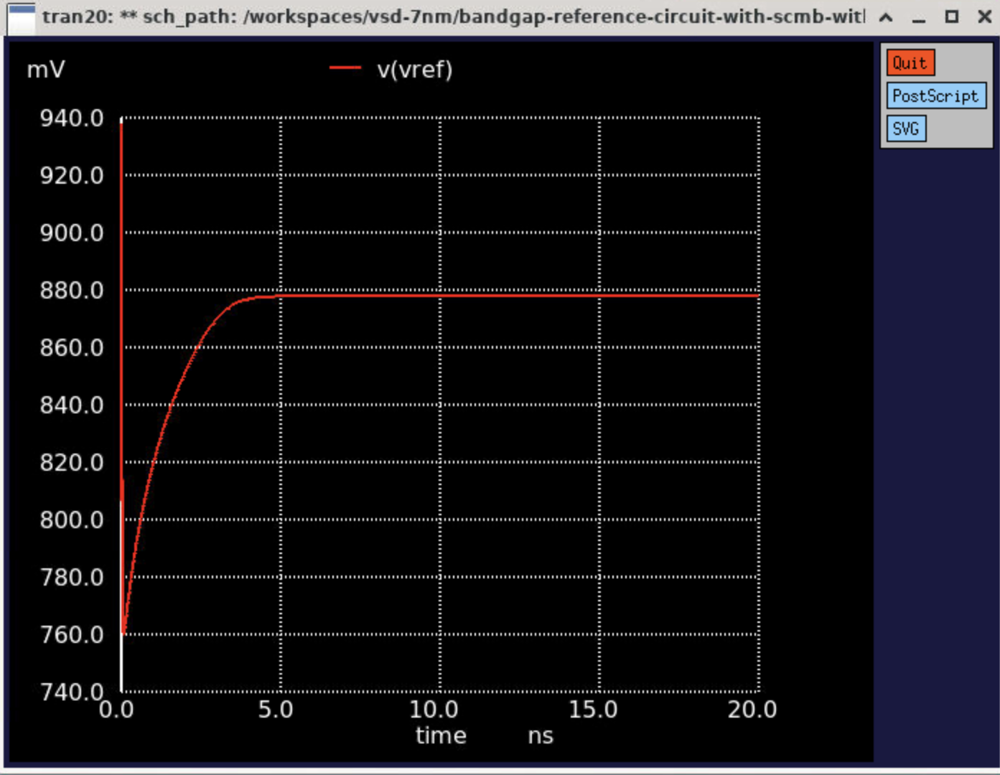
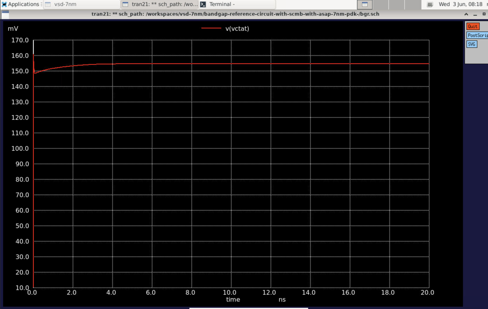
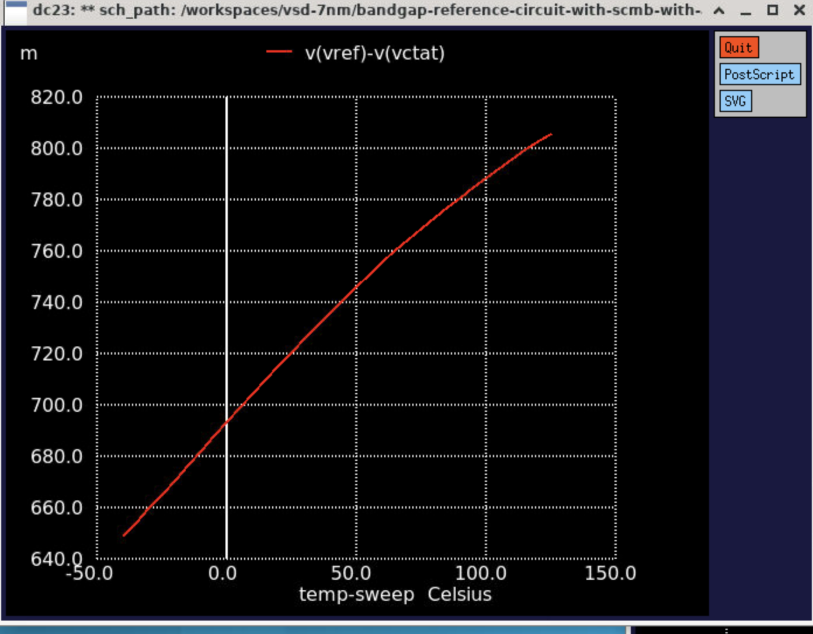
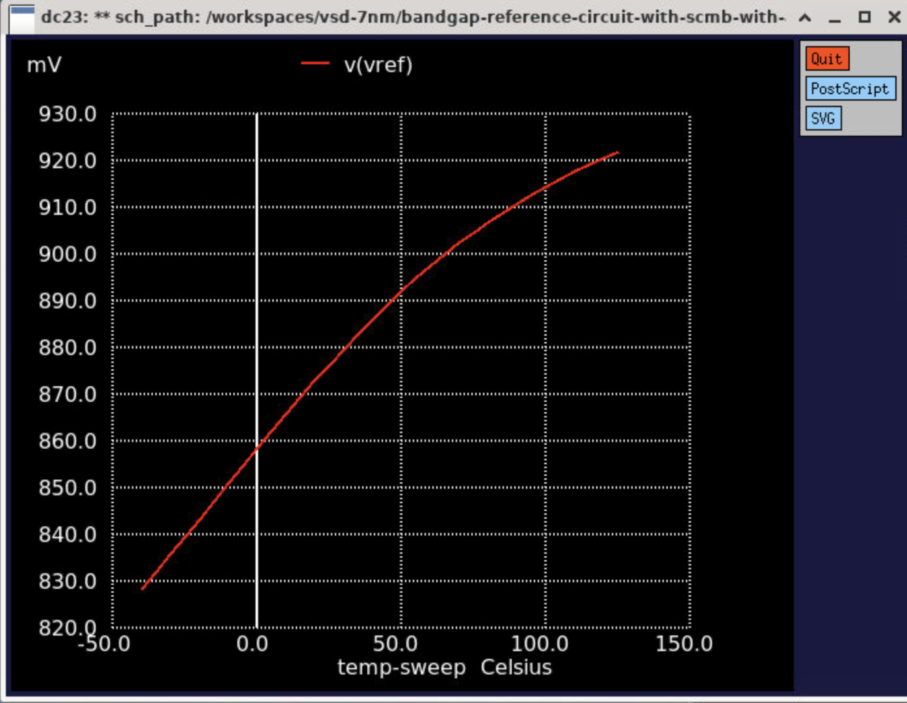
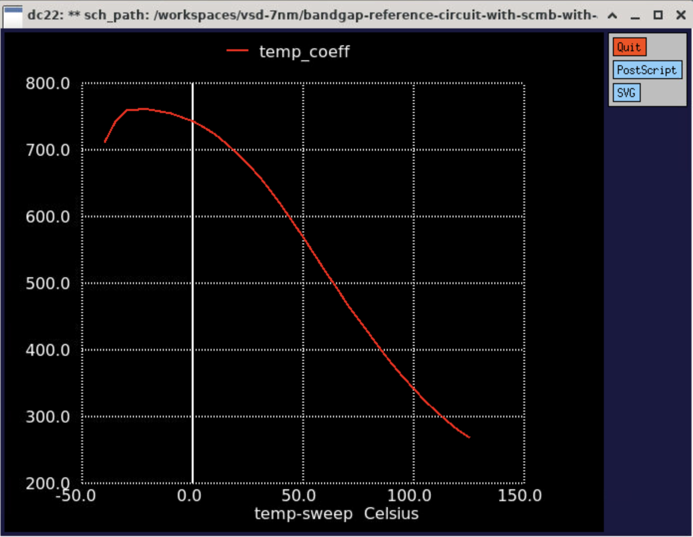

# Bandgap Reference Circuit with SCMB — ASAP 7nm PDK


---

## 📋 Table of Contents
1. [Objective](#objective)
2. [Circuit Overview](#circuit-overview)
3. [Unique Resistor](#unique-resistor)
4. [Schematic](#schematic)
5. [Simulation Setup](#simulation-setup)
6. [Characterization Table](#characterization-table)
7. [Vref vs Temperature Data](#vref-vs-temperature-data)
8. [Waveforms](#waveforms)
9. [Simulation Commands Reference](#simulation-commands-reference)

---

## Objective

Design and simulate a Bandgap Reference Circuit using Xschem and Ngspice with the ASAP 7nm PDK. Validate key behaviors including:
- Temperature stability of Vref
- Line regulation across VDD range
- Startup behavior using transient analysis

---

## Circuit Overview

| Parameter | Value |
|-----------|-------|
| PDK | ASAP 7nm FinFET (BSIMCMG model) |
| Schematic Tool | Xschem |
| Simulator | Ngspice-46+ |
| Supply Voltage | 0.7V – 1.1V |
| Temperature Range | -40°C to 125°C |
| Output Nodes | Vref, Vctat |
| PFET Count | 6 (asap_7nm_pfet, l=7nm, nfin=14) |
| NFET Count | 10 (asap_7nm_nfet, l=7nm, nfin=14) |
| R1 | 50kΩ (Vref to Vctat) |
| R2 | 33kΩ (bias network) |
| R3 | **518Ω** (unique startup resistor) |

---

## Unique Resistor

Resistor value derived from ASCII sum of username **`najla`**:

| Character | ASCII Value |
|-----------|-------------|
| n | 110 |
| a | 97 |
| j | 106 |
| l | 108 |
| a | 97 |
| **Total** | **518** |

Placed in the startup/bias branch:
```spice
R3 net10 GND 518 ac=1k
```

---

## Schematic


**Key components visible:**
- PFET current mirror (pfet1–pfet6) connected to VDD
- NFET differential pair (nfet1–nfet6) for PTAT/CTAT generation
- Startup circuit (nfet7–nfet10) at bottom
- R1=50k between Vref and Vctat
- R2=33k in bias network
- R3=518Ω unique resistor in startup branch
- V1=0.7V supply source

---

## Simulation Setup

### Netlist Summary
```spice
Xpfet1 net6 net1 VDD VDD asap_7nm_pfet l=7e-009 nfin=14
Xpfet2 net2 net1 VDD VDD asap_7nm_pfet l=7e-009 nfin=14
Xpfet3 net3 net1 net2 VDD asap_7nm_pfet l=7e-009 nfin=14
Xpfet4 net1 net1 VDD VDD asap_7nm_pfet l=7e-009 nfin=14
Xpfet5 net7 net1 net1 VDD asap_7nm_pfet l=7e-009 nfin=14
Xpfet6 Vref net1 VDD VDD asap_7nm_pfet l=7e-009 nfin=14
Xnfet1 net4 net4 net10 GND asap_7nm_nfet l=7e-009 nfin=14
...
R1 Vref vctat 50k ac=1k
R2 net9 net8 33k ac=1k
R3 net10 GND 518 ac=1k
V1 VDD GND PULSE(0 1.0 1n 0.1n 0.1n 50n 100n)
```

### Line Regulation Simulation
```spice
.dc V1 0.775 0.825 0.005
.control
  set temp = 27
  alter V1 = 0.8
  op
  print v(vref)
  dc V1 0.775 0.825 0.005
  meas dc v_max1 max v(vref)
  meas dc v_min1 min v(vref)
  let lr1 = ((v_max1 - v_min1) / 0.05) * 1000
  print lr1
.endc
```

### Startup Time Simulation
```spice
.ic V(Vref)=0 V(vctat)=0 V(net1)=0
.tran 0.01n 20n uic
.control
run
meas tran Vref_final FIND v(Vref) AT=18n
meas tran startup_time WHEN v(Vref)=0.99*Vref_final RISE=1
print startup_time
plot v(Vref)
.endc
```

### Temperature Sweep
```spice
.dc temp -40 125 5
.control
run
plot v(Vref) v(Vctat)
plot v(Vref)-v(Vctat)
let dVREF_dT = deriv(v(Vref)) * 1e6
plot dVREF_dT
meas DC VREF_Min MIN v(Vref)
meas DC VREF_Max MAX v(Vref)
print VREF_Min
print VREF_Max
.endc
```

---

## Characterization Table

| S.No | VDD (V) | Temp (°C) | Vref (mV) | Line Reg (mV/V) | Startup Time |
|------|---------|-----------|-----------|-----------------|--------------|
| 1 | 0.8 | 27 | 676.0 | 1010.0 | 2.16 ps |
| 2 | 0.9 | 27 | 777.0 | 1009.5 | 1.37 ps |
| 3 | 1.0 | 27 | 877.9 | 1008.1 | 1.06 ps |
| 4 | 1.0 | -40 | 828.4 | 1032.6 | 14.3 ns |
| 5 | 1.0 | 125 | 922.1 | 974.8 | 0.80 ps |

### Observations
- Vref **increases with temperature** — PTAT dominant behavior due to R3=518Ω in startup branch
- Line regulation **decreases with temperature** — circuit more stable at high temp
- Startup at -40°C is **14.3ns** — slower due to reduced transistor mobility at cold temperature
- Temperature coefficient = **0.568 mV/°C** across -40°C to 125°C

---

## Vref vs Temperature Data

| Temp (°C) | Vref (V) | | Temp (°C) | Vref (V) |
|-----------|----------|-|-----------|----------|
| -40 | 0.8284 | | 45 | 0.8892 |
| -35 | 0.8320 | | 50 | 0.8921 |
| -30 | 0.8358 | | 55 | 0.8949 |
| -25 | 0.8397 | | 60 | 0.8975 |
| -20 | 0.8435 | | 65 | 0.9001 |
| -15 | 0.8473 | | 70 | 0.9025 |
| -10 | 0.8511 | | 75 | 0.9047 |
| -5 | 0.8548 | | 80 | 0.9069 |
| 0 | 0.8585 | | 85 | 0.9090 |
| 5 | 0.8622 | | 90 | 0.9109 |
| 10 | 0.8659 | | 95 | 0.9128 |
| 15 | 0.8695 | | 100 | 0.9145 |
| 20 | 0.8730 | | 105 | 0.9162 |
| 25 | 0.8764 | | 110 | 0.9177 |
| 27 | 0.8779 | | 115 | 0.9192 |
| 30 | 0.8798 | | 120 | 0.9207 |
| 35 | 0.8830 | | 125 | 0.9221 |
| 40 | 0.8862 | | | |

**Summary:**
```
Vref_min = 828.4 mV  at temp = -40°C
Vref_max = 922.1 mV  at temp =  125°C
Temp Coefficient = 0.568 mV/°C
```

---

## Waveforms

### Transient — Vref Startup (VDD=1.0V, Temp=27°C)


- Vref starts from 0V, rises and stabilizes at **~878mV**
- Startup time = **1.06 ps**

### Transient — Vctat Startup (VDD=1.0V, Temp=27°C)


- Vctat starts from 0V, settles at **~155mV**
- CTAT behavior confirmed — decreases with temperature

### Vref and Vctat vs Temperature


- Vref increases with temperature — PTAT dominant
- Vctat decreases with temperature — CTAT behavior confirmed

### Vref - Vctat vs Temperature


- Difference increases linearly with temperature

### Vref vs Temperature


- Vref range: 828.4mV at -40°C to 922.1mV at 125°C

### Temperature Coefficient (dVref/dT)


- Temperature coefficient = **0.568 mV/°C**

---

## Simulation Commands Reference

| # | Command | Purpose |
|---|---------|---------|
| 1 | `.dc temp -40 125 5` | Temperature sweep -40 to 125°C |
| 2 | `.dc V1 0.7 1.1 0.1` | VDD sweep for line regulation |
| 3 | `.tran 0.01n 20n uic` | Transient with zero initial conditions |
| 4 | `meas DC VREF_Min MIN v(Vref)` | Find minimum Vref automatically |
| 5 | `meas DC VREF_Max MAX v(Vref)` | Find maximum Vref automatically |
| 6 | `meas tran startup_time WHEN v(Vref)=0.99*Vref_final` | Measure startup time at 99% of final value |
| 7 | `let dVREF_dT = deriv(v(Vref)) * 1e6` | Calculate temperature coefficient |
| 8 | `foreach vdd_val 0.8 0.9 1.0` | Loop through multiple VDD values |
| 9 | `reset` + `set temp = value` | Change temperature inside control block |
| 10 | `.ic V(Vref)=0 V(vctat)=0` | Force zero initial conditions for startup |

---

*VSD 7nm Workshop — BGR Assignment*
*Username: najla | Unique Resistor R3 = 518Ω | ASAP 7nm PDK*
